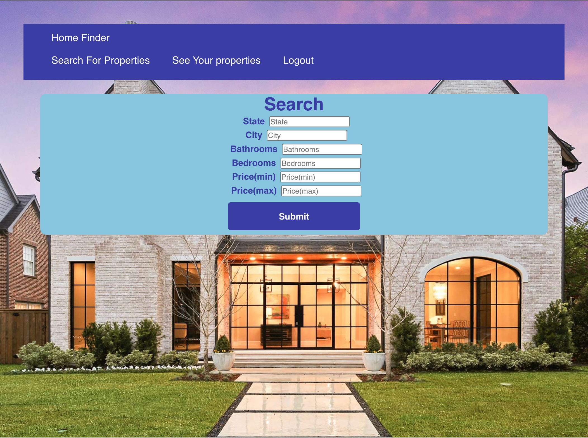
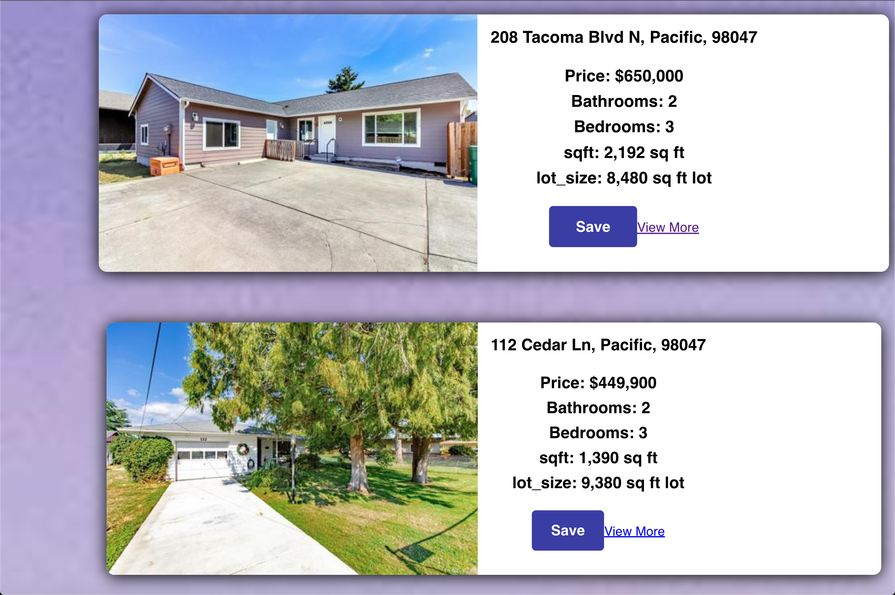

## Home-Guru

 [Deployed Webpage](https://home-guru.herokuapp.com/)
## Description
This project uses a third party API to search for homes listed for sale in any area the user searches. This application uses React, GraphQL and MongoDB. 

## Technologies
* React
* JSX
* GraphQL
* Bootstrap
* Node.js
* Javascript
* MongoDB

## Installation
`npm i`

`npm run develop`

## Usage
in order to run this application you must install React by typing 
`npx create-react-app [insert name here]`

once complete you can than start the server by typing:
`npm run develop`

## Preview

## Authors
* davidpascual2 (davidpascual200@gmail.com)
* Nourizadeh29 (snourizadeh@outlook.com)
* sscroggs11 (samscroggs11@gmail.com)
* ykangarani (kangarani.yousef1991@gmail.com)
